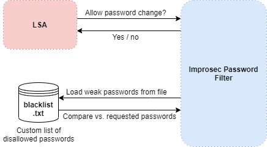

# Improsec Password Filter (IPF)
  

Block known weak passwords in your Active Directory environment(s).

## Introduction

The LSA process on Windows systems are responsible for handling password requests pertaining to password changes and resets. Windows allows for the configuration of arbitrary password filters and will automatically load these and ask them to verify the compliance or validity of a password every time a password modification is requested. Upon booting, the LSA process will load all password filters described in the following registry key:
* HKEY_LOCAL_MACHINE\SYSTEM\CurrentControlSet\Control\Lsa\Notification Packages

The password filters available in the above described registry key are only base filenames, i.e. without extensions, and will be loaded from the following path:
* C:\Windows\System32

The following image presents a high-level illustration of the flow between the LSA process and our custom password filter DLL:

Additionally, our password filter creates a thread, that will perform constant runtime monitoring of the contents of files in the "C:\improsec-filter" directory. Upon detection of file modifications, our password filter will reload the necessary files to make sure all configurations can be modified without rebooting the system.

**Important**: Since the DLL is being loaded by a core component of the Operating System, it is very important that the DLL has been built for the same platform (x86 or x64) as the underlying system – otherwise, the LSA process will not be able to load the filter DLL.

## Dependencies

### Microsoft Visual C++ Redistributable Package
Microsoft Visual C++ Redistributable Package is required by our *ipf.dll* filter.

##### Installation step-by-step
* Go to [Microsoft Latest Supported Visual C++ Download](https://support.microsoft.com/en-us/help/2977003/the-latest-supported-visual-c-downloads).
* Download and install the Visual Studio 2017 version of the Visual C++ Redistributable Package for your target platform:
  * For 32-bit systems: vc_redist.x86.exe
  * For 64-bit systems: vc_redist.x64.exe (recommended)
* No restart required.

It is important that the installed version of the Visual C++ Redistributable package matches the platform and the Visual Studio version used to compile the solution (default: x64 with Visual Studio 2017). If not, the DLL will fail to locate its dependencies and will not load.

## Install

The filter must be installed on a Domain Controller in the Active Directory domain. Note that if you have multiple Domain Controllers serving password change requests in the Active Directory domain, you must install the filter on each of them for full coverage. In order to install the solution, you can use either of the following methods.
* Automated installation
	* Configure the pass phrases you would like to block in *weak-phrases.txt* file
	* Run the installation PowerShell-script ([link](scripts/InstallFilter.ps1))
	* Restart the Domain Controller
* Manual installation
	* Create directory "*C:\\improsec-filter\\*"
	* Create a *weak-phrases.txt* file in the "*C:\\improsec-filter\\*" directory
		* Set the contents of the *weak-phrases.txt* file to a list of pass phrases you would like to block.
	* Create a file named *weak-enabled.txt* in the "*C:\\improsec-filter\\*" directory and set the contents of the file to '1'
		* Do this only if you want to enable the basic pass phrase blocking feature.
	* Create a file named *leaked-enabled.txt* in the "*C:\\improsec-filter\\*" directory and set the contents of the file to '1'
		* Do this only if you want to enable the compromised passwords blocking feature.
	* Move or copy the filter DLL into the "*C:\\Windows\\System32\\*" directory
	* Append the name of the filter DLL (default: *ipf*) to the following registry key
		* HKLM\\SYSTEM\\CurrentControlSet\\Control\\LSA\\Notification Packages
	* Restart the Domain Controller

Upon booting up, LSASS will now load our filter and use it to validate password changes going forward.

## Uninstall

In order to stop the solution from actively rejecting blocked password changes without having to restart the Domain Controller, simply set the contents of the "*C:\\improsec-filter\\weak-enabled.txt*" and "*C:\\improsec-filter\\leaked-enabled.txt*" files to '0'.

In order to completely uninstall the solution, you can use either of the following methods.
* Automated uninstallation
	* Run the uninstallation PowerShell-script ([link](scripts/UninstallFilter.ps1))
	* Restart the Domain Controller
* Manual uninstallation
	* Remove the name of the filter DLL (default: *ipf.dll*) from the following registry key
		* HKLM\\SYSTEM\\CurrentControlSet\\Control\\LSA\\Notification Packages
	* Restart the Domain Controller

Upon booting up, LSASS will no longer load our filter going forward. Optionally, you can now delete the "*C:\\improsec-filter\\*" directory as well as the filter DLL from the "*C:\\Windows\\System32\\*" directory.

## Usage

Once installed on a server, the filter will hook into the LSASS validation cycle and reject any password change involving passwords that are present in the list of disallowed pass phrases.

## Authors
* [**Valdemar Carøe**](https://github.com/st4ckh0und)
* Danske Bank

## License
  
This project is licensed under the MIT License - see the [LICENSE.md](LICENSE.md) file for details
